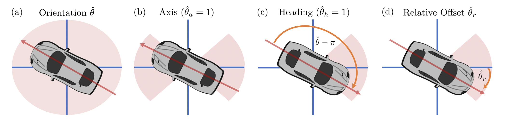
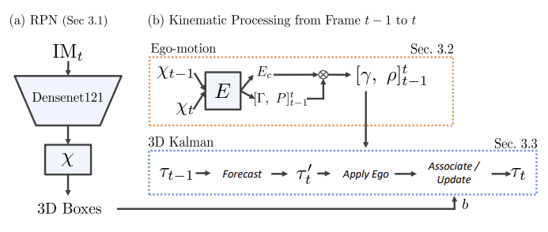

# The Kinematic3D Model

Kinematic3D seeks to utilize temporal motion to preceive the physical world in 3D for self-driving applications. They Proposes a single model & kalman filter framework which is composed of 3 primary components; a 3D region proposal network (RPN), ego-motion estimation, and a novel kinematic model (which employs a kalman filter) to take advantage of temporal motion in videos.

## 3D RPN 
The RPN consists of a backbone network and a detection head which predicts 3D box outputs relative to a set of predefined anchors. 

Here, Kinematic3D also proposes a novel object orientation formulation where they decompose orientation into 3 components; axis, heading and offset. This is a comprimise between classifying orientation via a series of discrete bins then regressing an offset, & directly regressing an offset. 

## Ego Motion
Kinematic3D estimates the ego motion of the capturing camera itself, narrowing down the work of the kalman filter to account for only the objects's motion. They define ego-motion in the conventional six degrees of freedom: translation `[γx, γy, γz]` in meters and rotation `[ρx, ρy, ρz]` in radians. Ultimately, they are able to model both ego motion and per-object velocity.

## Kinematics 
In order to leverage temporal motion, Kinematic3D integrates the 3D RPN and ego-motion into a kalman filter.  

### Basic Kalman Filter Framework:
The Kalman Filter contains 2 general steps: 
1. Prediction step -> using motion model and the state estimate from `t-1`, giving us a predicted state for `t`
2. update step -> using observation model and prediction state, giving us final state estimate for `t`

### Kinematic3D Kalman Filter

The framework uses an RPN to first estimate 3D boxes (Sec. 3.1). Ego-motion is estimated using boxes `Xt` and `Xt-1`. Previous frame tracks `τt−1` are then forcasted into `τt′` (prediction step) using the estimated Kalman velocity. Self-motion is then compensated for by applying the global ego-motion estimation to tracks `τt′`. Lastly, the 3D boxes are used as observations to update/fuse `τt′` with measurements using a kinematic 3D Kalman filter (Sec. 3.3). We now have the current estimated state of the track `τt`.

# The Code 

The original kinematic3d README can be found here; [kinematic3d.md](kinematic3d.md).

## Environment Setup

## Gstreamer PyTorch Pipeline 

